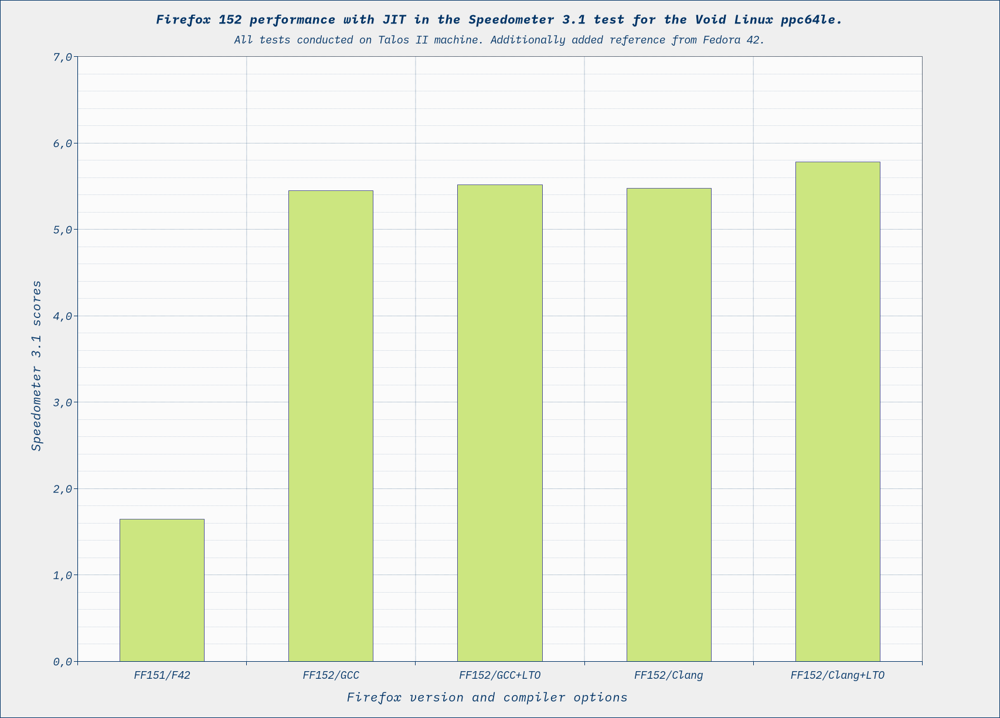

# Firefox 152 (with JIT/VSX Patches) Benchmarks on Void Linux ppc64le

This repository contains the results of the Speedometer 3.1 benchmark for various builds of Firefox 151/152. The browser was compiled using GCC 14.2.1 and Clang 22.1.4 (with and without LTO/PGO) on Void Linux, incorporating custom patches to fix VSX alignment issues and fully unlock the JIT compiler, and compared against the default Fedora 42 package on the POWER9 architecture.

The tests were conducted on a Talos II workstation equipped with 64 GB of RAM, a 1 TB SSD with the ZFS file system, and the Linux kernel version 6.18.34_1.

## Methodology

To ensure maximum reproducibility and eliminate background system noise, the following benchmarking protocol was strictly enforced:

- **CPU Pinning:** Processor frequency was explicitly locked to a stable maximum of 2.8 GHz to prevent Dynamic Voltage and Frequency Scaling (DVFS) from skewing the results:

```bash
$ sudo cpupower --governor performance

```

- **Environment Isolation:** Started a minimal, lightweight GUI environment (Enlightenment/E27) to eliminate heavy window manager overhead.

- **Process Spawning:** Launched a clean terminal emulator session and executed Firefox using the following command to enforce process isolation and create a completely sterile, telemetry-free profile, without triggering the unaccelerated fallback paths of standard safe mode:

```bash
$ firefox --new-instance --private-window

```

- **Benchmark Initialization:** Navigated to the official Speedometer 3.1 page (https://browserbench.org/Speedometer3.1/).

- **JIT & Cache Warming:** Executed an initial test run to allow for JIT compilation and cache warming. The results of this first run were intentionally discarded.

- **Cool-down Period:** Allowed the system to settle in an idle state for several seconds after the warm-up run.

- **Data Collection:** Initiated the benchmark execution and exported the detailed raw results in CSV format.

- **Iteration Protocol:** Repeated the warm-up, cool-down, testing, and data-saving cycle four additional times, resulting in a total of 5 valid, data-yielding iterations for each build variant.

## Compilation times

| Time       | Clang        | Clang + LTO  | Clang + LTO + PGO | GCC          | GCC + LTO    | GCC + LTO + PGO |
| ---        | ---:         | ---:         | ---:              | ---:         | ---:         | :---:           |
| **Real**   |  43m 30.668s |  45m 32.136s |      185m 59.535s |  67m 05.885s |  84m 28.716s |       N/A       |
| **User**   | 541m 29.937s | 707m 56.437s |     1458m 08.164s | 894m 33.491s | 856m 18.920s |       N/A       |
| **System** |  15m 09.471s |  15m 07.686s |       37m 57.593s |  29m 28.430s |  40m 11.677s |       N/A       |

### Toolchain Limits & PGO Anomaly

Profile-Guided Optimization (PGO) results are omitted from the performance table due to current toolchain limitations on the ppc64le architecture (specifically regarding VSX alignment). Instrumenting the GCC build resulted in an Internal Compiler Error (ICE), rendering it `N/A`. The Clang PGO build completed after an excessive compilation time but resulted in a runtime application crash.

## Speedometer 3.1 Performance Results

The following table presents the statistical summary of the 5 iterations for each viable build variant.

| Parameter | FF151 / F42 (Base) | FF152 / GCC | FF152 / GCC+LTO | FF152 / Clang | FF152 / Clang+LTO |
| --- | --- | --- | --- | --- | --- |
| **Minimum** | 1.601 | 5.092 | 5.318 | 5.284 | 5.675 |
| **Quartile I** | 1.640 | 5.419 | 5.482 | 5.444 | 5.741 |
| **Median** | 1.647 | 5.471 | 5.525 | 5.484 | 5.782 |
| **Quartile III** | 1.659 | 5.502 | 5.559 | 5.528 | 5.816 |
| **Maximum** | 1.686 | 5.567 | 5.628 | 5.585 | 5.875 |
| **Average** | **1.647** | **5.449** | **5.518** | **5.478** | **5.779** |
| **Stdev** | 0.018 | 0.086 | 0.063 | 0.065 | 0.050 |



## Conclusion

Native compilation with optimized VSX targeting yields massive performance gains. The native **Clang+LTO** build on Void Linux achieves an average score of **5.779**, representing a **~250% performance increase (~3.5x multiplier)** over the default Fedora 42 package (1.647). Furthermore, GCC builds exhibit noticeable UI thread desynchronization (laggy "burger menu"), indicating that LLVM/Clang remains the superior compiler ecosystem for modern browser engines on POWER9.

